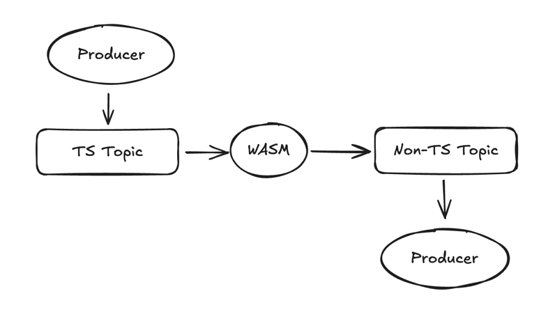
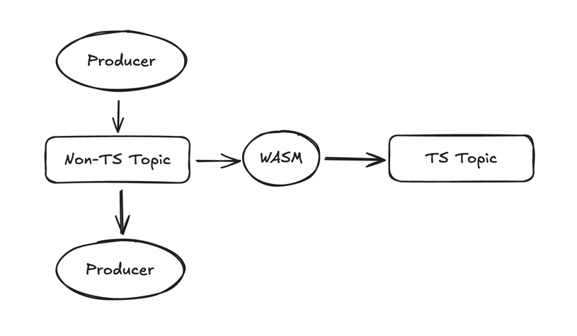
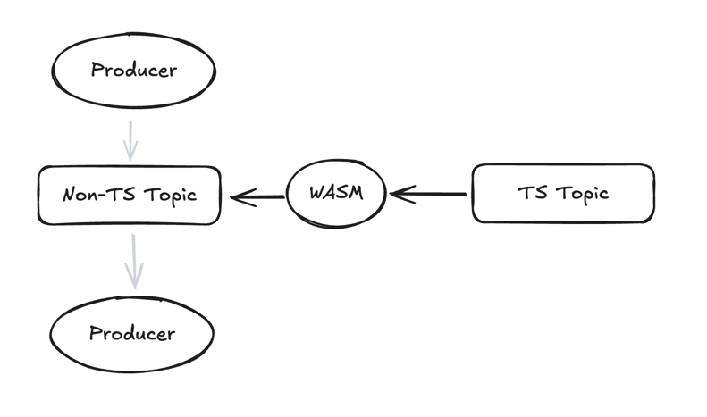

# Redpanda Last Value Cache Demo!

Welcome to the Redpanda Last Value Cache demo. This demo will install and configure the following components on K8s:

- Minio (local S3 storage)
- Redpanda (our beloved streaming system!)

# Setup

### Configure Namespaces

First, configure the namespaces you want to install to by editing [`config`](config):

```zsh
vim config
```

```zsh
export MINIO_NAMESPACE=minio
export REDPANDA_NAMESPACE=redpanda
```

### Run the setup scripts

To install Minio and Redpanda, run the setup scripts:

```bash
# Be sure to use source when installing Minio, since the script publishes environment
# variables used when installing Redpanda

# Install Minio
source ./1-install-minio.sh

# Install Redpanda
./2-install-redpanda.sh
```

## Demo

The demo is built using multiple scripts:

### Approach A (for topics where the readers and writers can use different topics)

In this approach, the source topic is in tiered storage, which connects to the destination topic (not in tiered storage)
via WASM:



#### Implementation

- The first script creates the topics required, configures them appropriately, configures the compaction to be
demo-friendly and deploys the transform;
- The second script shows producing to the source topic and consuming from the (highly compacted) destination topic;
- The third script shows how we can recreate the destination topic by redeploying the transform and having it process
all the existing data 

```bash
# Create and configure topics
./3a-create-topics.sh

# Produce some messages and consume, demonstrating the topics and compaction
./4a-usage.sh

# Drop the local topic and demonstrate reconstruction
./5a-recreate.sh
```

### Approach B (for topics where the readers and writers need the same topic)

The second approach shows a similar setup, but has a primary (non-TS) topic that serves all reads and writes, while a
secondary (TS) topic acts as a backup. The backup is populated via WASM:



On restore, we recreate the primary (non-TS) topic and deploy a reverse WASM transform to repopulate:



Once the restore is completed, we revert the flow by deploying the original forward transform.

#### Implementation

There are a similar set of scripts:

```bash
# Create and configure topics
./3b-create-topics.sh

# Produce some messages and consume, demonstrating the topics and compaction
./4b-usage.sh

# Drop the local topic and demonstrate reconstruction
./5b-recreate.sh
```

In practice, with Approach B it would be necessary to monitor the lag of the restore process using a metric such as
`redpanda_transform_processor_lag`. Once this hits zero, the restore transform can be removed and replaced with a forward
transform.